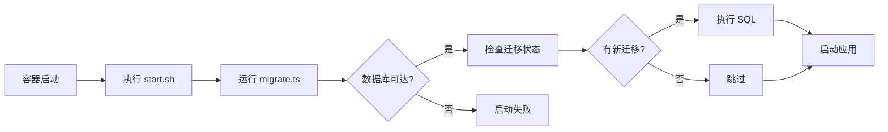

# 自动数据库迁移

## 概述

项目在 Docker 容器启动时会**自动执行数据库迁移**，无需手动干预。

## 工作原理

### 启动流程



### 关键文件

**1. `backend/src/migrate.ts`** - 迁移脚本
```typescript
// 使用 drizzle-orm 的原生 migrate API
// 不依赖 drizzle-kit（开发依赖）
await migrate(db, { migrationsFolder: './drizzle' })
```

**2. `backend/start.sh`** - 容器启动脚本
```bash
bun run src/migrate.ts  # 先迁移
exec bun run dist/index.js  # 后启动
```

**3. `backend/drizzle/`** - 迁移文件目录
- `0000_xxx.sql` - SQL 迁移文件
- `meta/_journal.json` - 迁移版本记录

## 性能影响

### 测试结果

| 场景 | 时间 | 说明 |
|------|------|------|
| **无新迁移（常见）** | ~100-200ms | 只查询检查，快速跳过 |
| **有新迁移** | ~2-5s | 取决于 SQL 复杂度 |
| **数据库不可达** | ~3s | 连接超时后失败 |

### 实际影响

```
🗄️  Running database migrations...     ← 迁移开始
✅ Migrations completed successfully    ← ~150ms 后完成
🚀 Starting application...              ← 应用启动
```

**结论：对启动时间影响极小（< 200ms），可忽略不计。**

## 幂等性保证

### Drizzle 的迁移机制

1. 在数据库中创建 `__drizzle_migrations` 表
2. 记录每个已执行的迁移文件哈希
3. 每次启动检查哪些迁移未执行
4. 只执行新的迁移

### 验证幂等性

```bash
# 重启容器 10 次
for i in {1..10}; do
    docker restart fullstack-backend
    sleep 3
done

# 查看日志 - 每次都会看到 "Migrations completed successfully"
docker logs fullstack-backend
```

**✅ 多次运行结果完全一致，不会重复执行已有迁移。**

## 并发安全

### 多实例场景

如果同时启动多个后端容器（如 Kubernetes 水平扩展）：

1. **第一个容器**：获得数据库锁，执行迁移
2. **其他容器**：等待锁释放，检查发现已完成，跳过
3. **所有容器**：正常启动应用

Drizzle 使用 PostgreSQL 的事务锁保证并发安全。

## 故障处理

### 迁移失败怎么办？

如果迁移脚本出错：

```bash
❌ Migration failed: ...error details...
```

**容器会立即退出（exit 1）**，应用不会启动。

**这是设计行为 - Fail Fast 原则：**
- ✅ 防止应用在数据库结构不一致时启动
- ✅ 强制开发者立即修复迁移问题
- ✅ 避免生产环境数据损坏

### 修复步骤

1. 查看容器日志定位错误
   ```bash
   docker logs fullstack-backend
   ```

2. 修复迁移文件或数据库问题

3. 重新生成迁移（如需要）
   ```bash
   cd backend
   bun run db:generate
   ```

4. 重启容器
   ```bash
   docker compose -f docker/docker-compose.yml restart backend
   ```

## 开发工作流

### 添加新字段的完整流程

```bash
# 1. 修改 schema
cd backend
vi src/db/schema.ts

# 2. 生成迁移
bun run db:generate

# 3. 本地测试迁移
bun run db:migrate

# 4. 提交代码（包含迁移文件）
git add src/db/schema.ts drizzle/
git commit -m "【ADD】用户表新增头像字段"

# 5. 部署 - 迁移自动执行
docker compose up -d --build
```

## 禁用自动迁移

如果你需要手动控制迁移时机（不推荐）：

**修改 `backend/start.sh`：**
```bash
#!/bin/sh
set -e

# 注释掉自动迁移
# bun run src/migrate.ts

echo "🚀 Starting application..."
exec bun run dist/index.js
```

**然后手动执行迁移：**
```bash
docker exec fullstack-backend bun run src/migrate.ts
```

## 最佳实践

### ✅ 推荐

1. **向后兼容的迁移**
   - 新增字段设置默认值或允许 NULL
   - 先添加字段，后删除旧字段（两步迁移）

2. **小步快跑**
   - 每次迁移只做一个改动
   - 避免大规模数据迁移（使用批处理脚本）

3. **测试迁移**
   - 在开发环境测试后再部署
   - 使用生产数据的副本测试

### ❌ 避免

1. **破坏性迁移**
   ```sql
   -- 不要直接删除列（旧代码还在使用）
   ALTER TABLE users DROP COLUMN old_field;
   
   -- 应该分两步：
   -- Step 1: 停止使用 old_field（部署新代码）
   -- Step 2: 删除 old_field（再次部署）
   ```

2. **依赖外部资源**
   ```typescript
   // 不要在迁移中调用外部 API
   await fetch('https://api.example.com/data')
   ```

3. **长时间运行的迁移**
   - 数百万行数据迁移会阻塞启动
   - 应该用独立的批处理脚本

## 监控和日志

### 查看迁移历史

```sql
-- 连接数据库
docker exec -it fullstack-postgres psql -U postgres -d fullstack_db

-- 查看迁移记录
SELECT * FROM drizzle.__drizzle_migrations;
```

### 输出示例

```
 id | hash                              | created_at
----+-----------------------------------+-------------------------
  1 | 0000_cold_tinkerer                | 2025-12-13 15:36:30.123
```

## 常见问题

### Q: 每次重启都会执行迁移，影响性能吗？

A: **不会**。已执行的迁移只需 100-200ms 检查时间，对启动几乎无影响。

### Q: 多个容器同时启动会冲突吗？

A: **不会**。Drizzle 使用数据库锁保证只有一个容器执行迁移。

### Q: 如何回滚迁移？

A: Drizzle 不支持自动回滚。需要手动编写反向迁移：
```bash
# 生成新的迁移来撤销之前的改动
bun run db:generate
```

### Q: 迁移失败会导致数据损坏吗？

A: **不会**。迁移在事务中执行，失败会自动回滚。

---

## 总结

**自动迁移 = 零运维 + 零出错**

- ✅ 容器启动自动迁移
- ✅ 幂等安全，可重复运行
- ✅ 并发安全，支持多实例
- ✅ Fail Fast，防止数据不一致
- ✅ 性能影响可忽略（< 200ms）

**"Talk is cheap. Show me the code."** - 自动迁移让部署更简单，让错误更早暴露。

