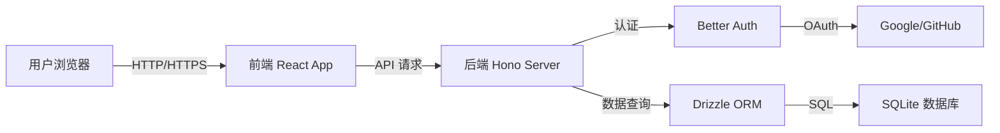

# 项目结构

## 目录组织

```
bun_projcet/
├── backend/                 # 后端 API 服务
│   ├── src/
│   │   ├── db/
│   │   │   ├── index.ts    # 数据库连接
│   │   │   └── schema.ts   # 数据库表结构
│   │   ├── lib/
│   │   │   └── auth.ts     # Better Auth 配置
│   │   └── index.ts        # API 入口文件
│   ├── drizzle.config.ts   # Drizzle 配置
│   └── package.json
├── frontend/                # 前端 React 应用
│   ├── src/
│   │   ├── components/ui/  # Shadcn UI 组件
│   │   ├── hooks/
│   │   │   └── useAuth.ts  # Auth Hook
│   │   ├── lib/
│   │   │   ├── auth-client.ts  # Better Auth 客户端
│   │   │   └── utils.ts
│   │   ├── pages/
│   │   │   ├── HomePage.tsx
│   │   │   ├── LoginPage.tsx
│   │   │   └── RegisterPage.tsx
│   │   ├── App.tsx
│   │   └── main.tsx
│   └── package.json
├── docs/                    # 文档目录
├── package.json             # 根配置（workspaces）
└── README.md
```

## 后端目录详解

### `/backend/src/db/`
- **index.ts**: 数据库连接配置，使用 Bun 的原生 SQLite 支持
- **schema.ts**: Drizzle ORM 数据表定义

### `/backend/src/lib/`
- **auth.ts**: Better Auth 配置，包含邮箱密码、Google、GitHub 等认证策略

### `/backend/src/index.ts`
- API 路由定义
- 中间件配置（CORS、Logger）
- Hono 应用主入口

## 前端目录详解

### `/frontend/src/components/ui/`
Shadcn UI 组件库，所有 UI 组件均可独立使用：
- `button.tsx` - 按钮组件
- `card.tsx` - 卡片组件
- `input.tsx` - 输入框组件
- `label.tsx` - 标签组件
- 更多组件可通过 `bunx shadcn add [name]` 添加

### `/frontend/src/hooks/`
自定义 React Hooks：
- `useAuth.ts` - 认证状态管理 Hook

### `/frontend/src/lib/`
工具函数和客户端：
- `auth-client.ts` - Better Auth 前端客户端
- `api-client.ts` - 类型安全的 API 客户端（Hono RPC）
- `utils.ts` - 通用工具函数
- `i18n/` - 国际化配置

### `/frontend/src/pages/`
页面组件：
- `HomePage.tsx` - 首页
- `LoginPage.tsx` - 登录页
- `RegisterPage.tsx` - 注册页

## 配置文件

### 根目录
- `package.json` - Workspace 配置，管理 monorepo
- `bunfig.toml` - Bun 配置文件

### 后端
- `drizzle.config.ts` - Drizzle ORM 配置
- `tsconfig.json` - TypeScript 配置

### 前端
- `vite.config.ts` - Vite 构建配置
- `tailwind.config.ts` - Tailwind CSS 配置
- `components.json` - Shadcn UI 配置
- `tsconfig.json` - TypeScript 配置
- `eslint.config.js` - ESLint 配置

## 数据流



## Monorepo 架构

项目使用 Bun Workspaces 管理多个包：

```json
{
  "workspaces": ["backend", "frontend"]
}
```

**优势**：
- 共享依赖，减少磁盘空间
- 统一的构建命令
- 类型可以跨项目共享

